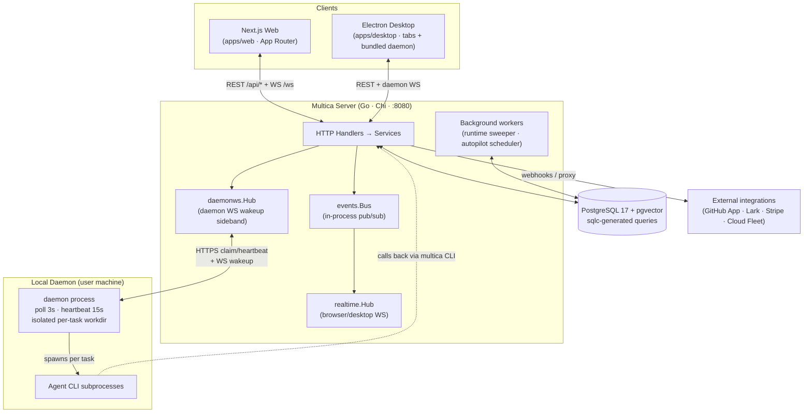

# System Architecture

A focused system architecture diagram for Multica. For the full high-level
design prose, see [`DESIGN.md`](../DESIGN.md) §2; for agent-working conventions,
see [`CLAUDE.md`](../CLAUDE.md).

## Diagram



## ASCII version (terminal-friendly)

```
┌──────────────┐     ┌──────────────┐
│  Next.js Web │     │ Electron     │
│  (App Router)│     │ Desktop      │
└──────┬───────┘     └──────┬───────┘
       │  REST /api/* + WS /ws
       └──────────┬──────────┘
                  ▼
   ┌──────────────────────────────────────────────────┐
   │            Multica Server (Go · Chi · :8080)      │
   │  ┌────────────────┐    ┌───────────────────────┐  │
   │  │ HTTP Handlers  │───▶│   events.Bus          │  │
   │  │   → Services   │    │   (in-process pub/sub)│  │
   │  └────────┬───────┘    └──────────┬────────────┘  │
   │           │                        │               │
   │  ┌────────▼────────┐  ┌───────────▼────────────┐  │
   │  │ realtime.Hub    │  │ daemonws.Hub           │  │
   │  │ (browser WS)    │  │ (daemon WS wakeup)     │  │
   │  └─────────────────┘  └───────────┬────────────┘  │
   │  Background workers:               │               │
   │  runtime sweeper · autopilot sched │               │
   └────────┬───────────────────────────┼──────────────┘
            │                           │ HTTPS
            ▼                           │ claim/heartbeat + WS wakeup
   ┌──────────────────┐        ┌────────▼────────────────┐
   │ PostgreSQL 17    │        │ Local Daemon (your box) │
   │ + pgvector       │        │ poll 3s · heartbeat 15s│
   │ sqlc queries     │        │ per-task isolated workdir│
   └──────────────────┘        └────────┬────────────────┘
                                        │ spawns subprocess per task
                   ┌──────┬──────┬──────┼──────┬──────┐
                   ▼      ▼      ▼      ▼      ▼      ▼
                Claude  Codex  Copilot Cursor OpenCode Pi
                 Code                  Agent
                                        │
                                        └─. calls back to server via
                                            `multica` CLI (read/write issues)

   Server ──webhook/proxy──▶ GitHub App · Lark · Stripe · Cloud Fleet (SaaS)
```

## Component responsibilities

| Layer | Owns | Does NOT |
|---|---|---|
| **Web / Desktop client** | UI, client state (Zustand), server-state cache (TanStack Query), WS subscriptions | Business rules, LLM calls |
| **Server** | Persistence, authz, task orchestration, event broadcast, autopilot scheduling, runtime health | Execute agents, call LLMs directly |
| **Daemon** | Detect local CLIs, claim tasks, manage isolated workdirs, stream output back, session resume | Business decisions — only runs what the server dispatches |
| **Agent CLI** (Claude Code, Codex, Copilot, Cursor, OpenCode, Pi) | Invoke the LLM, run tools, edit files, run tests | Knows Multica's data model — all context is read back via the `multica` CLI |

## Key boundaries

- **Two WebSocket hubs, not one.** `realtime.Hub` serves browser/desktop
  clients (workspace/user rooms); `daemonws.Hub` serves daemons (task-available
  wakeups + heartbeats). Separate so daemon traffic can't crowd out user
  fanout, and so the optional Redis relay can route daemon wakeups on a
  dedicated `daemon_runtime` scope across API nodes.
- **Daemon is pull-based.** The server never pushes a task body to a runtime.
  The daemon long-polls `POST /api/daemon/runtimes/{id}/tasks/claim` and gets
  a wakeup nudge over the daemon WS sideband. Task bodies move over HTTP
  request/response; the WS is wakeup-only.
- **LLM calls happen only in the agent CLI subprocess.** The server and daemon
  never call an LLM API. They prepare the prompt + env + workdir, spawn the
  CLI, and stream its stdout back. So there is no prompt-engineering code path
  in the server beyond a few templates (task / chat / comment-triggered).
- **Workspace is the multi-tenant boundary.** Every workspace-scoped query
  filters by `workspace_id`; membership checks gate access; `X-Workspace-Slug`
  routes requests.

## Request / auth paths

| Caller | Transport | Token |
|---|---|---|
| Browser | REST + `/ws` (cookie JWT, or first-frame PAT) | JWT cookie, `mul_` PAT |
| Desktop | REST + daemon WS | JWT cookie, `mul_` PAT |
| Daemon | `POST /api/daemon/*` + `/api/daemon/ws` | `mdt_` daemon token, `mcn_` cloud-node PAT, or `mul_` PAT |
| Agent process | `multica` CLI calls back to `/api/*` | `mat_` per-task token (minted at claim, 24h) |

## Data flow: a task from assignment to result

1. **Trigger** — issue assign / @mention / autopilot / chat / quick-create →
   `TaskService.Enqueue*` inserts an `agent_task_queue` row at `queued` and
   publishes `task:queued` on `events.Bus` → `NotifyTaskEnqueued` wakes the
   daemon via `daemonws.Hub`.
2. **Dispatch** — daemon claims (`queued → dispatched`), mints an `mat_` task
   token, starts (`→ running`), streams `task:message` rows, then
   `CompleteTask` / `FailTask` (terminal).
3. **Notify** — every transition publishes `task:*` on `events.Bus`; the bridge
   listener fans out to `realtime.Hub` → workspace-scoped browser/desktop WS
   clients. Activity, autopilot, and notification listeners react on the same
   bus.
4. **Result** — terminal `result` JSONB lives on `agent_task_queue`; clients
   re-fetch via the list/snapshot/messages endpoints.
